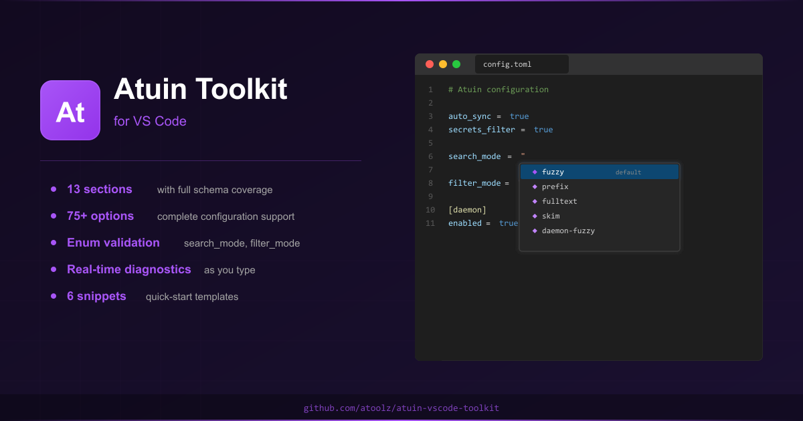
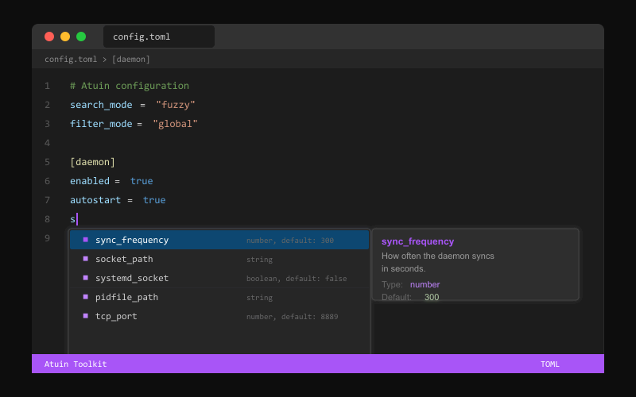
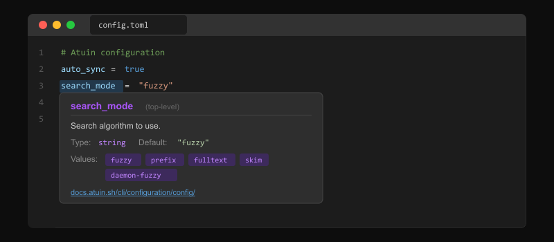
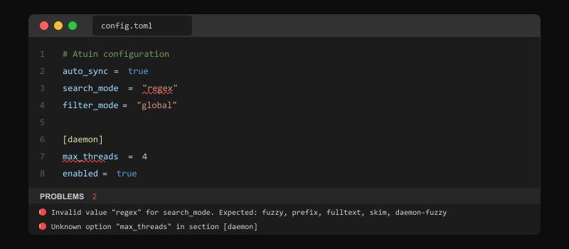

<p align="center">
  
</p>

<h1 align="center">Atuin Toolkit</h1>

<p align="center">
  <strong>Complete IntelliSense, validation, and documentation for Atuin <code>config.toml</code> configuration</strong>
</p>

<p align="center">
  <a href="https://marketplace.visualstudio.com/items?itemName=atoolz.atuin-vscode-toolkit">
    
  </a>
  <a href="https://marketplace.visualstudio.com/items?itemName=atoolz.atuin-vscode-toolkit">
    
  </a>
  <a href="https://marketplace.visualstudio.com/items?itemName=atoolz.atuin-vscode-toolkit">
    
  </a>
  <a href="https://github.com/atoolz/atuin-vscode-toolkit/blob/main/LICENSE">
    
  </a>
  <a href="https://atuin.sh">
    
  </a>
</p>

---

[Atuin](https://atuin.sh) replaces your existing shell history with a SQLite database, recording additional context for your commands. It provides optional encrypted synchronization between machines through an Atuin server. This extension brings first-class editing support for Atuin `config.toml` configuration files directly into VS Code.

## Features

### IntelliSense Completions

Full autocompletion for all 13 Atuin config sections, their options, enum values, and defaults.

- **Section headers** - Autocomplete `[section_name]` with all known sections
- **Section options** - Context-aware option completion with types and defaults
- **Enum values** - Suggest valid values for `search_mode`, `filter_mode`, `style`, `keymap_mode`, and more
- **Top-level options** - Complete all 37 root-level configuration options

<p align="center">
  
</p>

### Hover Documentation

Hover over any section name or option to see its description, type, default value, allowed enum values, and a direct link to the [Atuin documentation](https://docs.atuin.sh/cli/configuration/config/).

<p align="center">
  
</p>

### Diagnostics and Validation

Real-time validation catches configuration errors as you type:

- Unknown section names
- Unknown options within sections
- Invalid enum values (e.g. invalid `search_mode` or `filter_mode`)
- Type mismatches (string where boolean expected, etc.)

<p align="center">
  
</p>

### Snippets

Quick-start templates for common configurations:

| Prefix | Description |
|---|---|
| `atuin-starter` | Complete starter config with common settings |
| `atuin-daemon` | Daemon configuration for background sync |
| `atuin-sync` | Sync server configuration |
| `atuin-search` | Search tuning with scoring multipliers |
| `atuin-theme` | Theme configuration |
| `atuin-ui` | UI and columns configuration |

## Supported Sections

All 12 official Atuin config sections are supported with full option definitions, plus 37 top-level options:

`daemon` `sync` `search` `stats` `keys` `preview` `theme` `logs` `ui` `ai` `dotfiles` `tmux`

## Installation

1. Open VS Code
2. Go to Extensions (`Ctrl+Shift+X` / `Cmd+Shift+X`)
3. Search for **Atuin Toolkit**
4. Click **Install**

Or install from the command line:

```bash
code --install-extension atoolz.atuin-vscode-toolkit
```

## Requirements

- VS Code 1.85.0 or higher
- A TOML language extension (e.g., [Even Better TOML](https://marketplace.visualstudio.com/items?itemName=tamasfe.even-better-toml)) for syntax highlighting

The extension activates automatically when you open a file named `config.toml` inside an `.atuin` or `atuin` directory, or any file matching `**/atuin/config.toml`.

## Configuration

No additional configuration needed. The extension works out of the box for Atuin config files.

## Contributing

Contributions are welcome. Please open an issue or pull request on [GitHub](https://github.com/atoolz/atuin-vscode-toolkit).

## License

[MIT](LICENSE)
